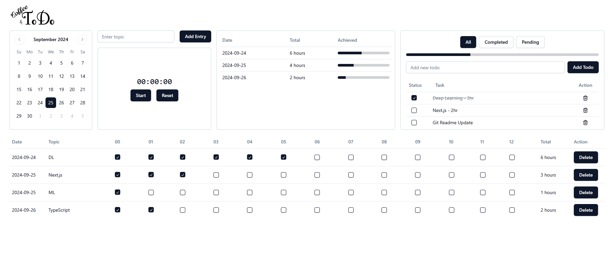

# Coffee & ToDo

A web-based Study Tracker that helps users track their study sessions with a built-in timer and ToDo list. The project is built with React, Shadcn/UI, Tailwind CSS, and TypeScript for the frontend, and SQLite3, Node.js, and Express.js for the backend. This is a basic project. Feel free to extend and customize it to meet your needs.



## Features

- **Timer**: Track study hours with a simple timer.
- **ToDo List**: Manage tasks and organize study sessions.
- **Daily Log**: Keep track of daily study progress.

## Technologies

### Frontend:

- **React**
- **Shadcn/UI**
- **Tailwind CSS**
- **TypeScript**

### Backend:

- **Node.js**
- **Express.js**
- **SQLite3**

## Installation

### Prerequisites

- **Node.js**: Ensure you have Node.js installed. Or You can download it from [here](https://nodejs.org/).
- **npm**: Make sure you have npm installed globally.

### Steps to Run Locally:

1. **Clone the Repository**:

   ```bash
   git clone https://github.com/Faysal-star/coffee_and_todo.git
   cd coffee_and_todo
   ```
2. **Install Frontend Dependencies**:
   Navigate to the `frontend` directory and install the dependencies:

   ```bash
   cd Frontend
   npm install
   ```
3. **Install Backend Dependencies**:
   Navigate to the `backend` directory and install the dependencies:

   ```bash
   cd Backend
   npm install
   ```
4. **Run the Backend**:
   Start the backend server by running the following command from the `backend` directory:

   ```bash
   cd Backend
   npm run dev
   ```
5. **Run the Frontend**:
   In a separate terminal, start the frontend development server from the `frontend` directory:

   ```bash
   cd Frontend
   npm run dev
   ```
6. **Access the Application**:
   The application should now be running at ``http://localhost:5173/`` (or see the terminal for port).

## One Click Run [For Windows]

After installing the dependencies for both the frontend and backend, you can use the ``coffee_and_todo.vbs`` script to launch the web app with a single click. Simply update the script with the paths to your frontend and backend folders.

**Open The ``coffee_and_todo.vbs`` script and change the paths**

```vbnet
backendPath = "C:\path\to\backend"
frontendPath = "C:\path\to\frontend"
```

You can use the vbs script as shortcut to open the web-app.

## Contribution

Feel free to fork the repository and submit pull requests. All contributions are welcome!
